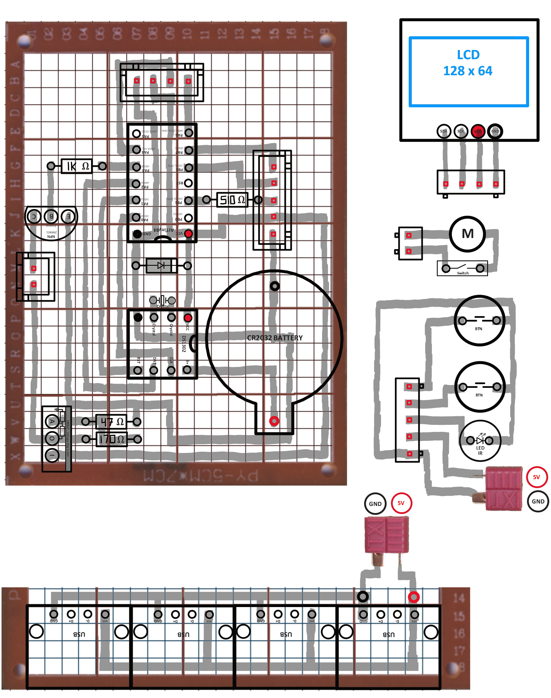
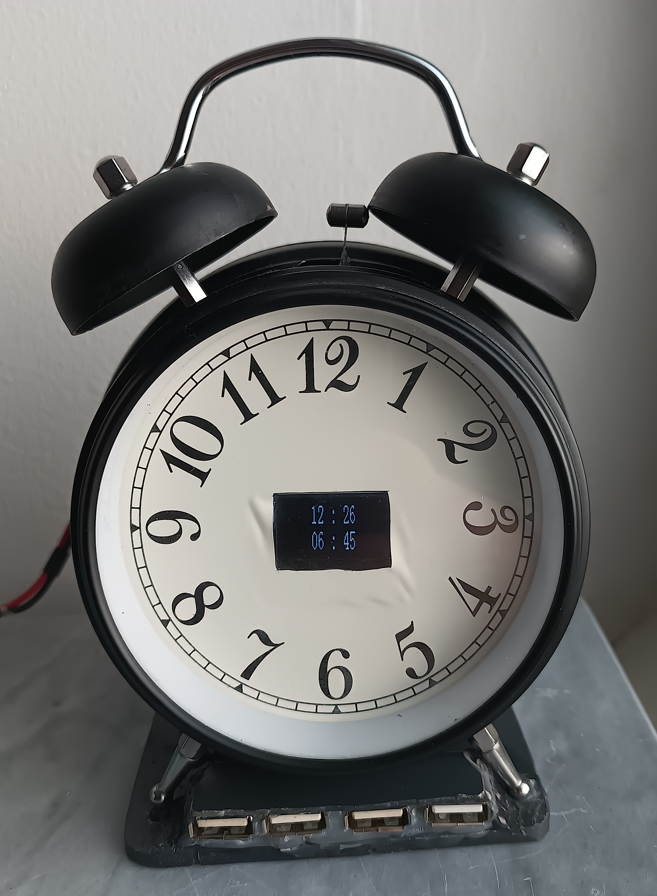
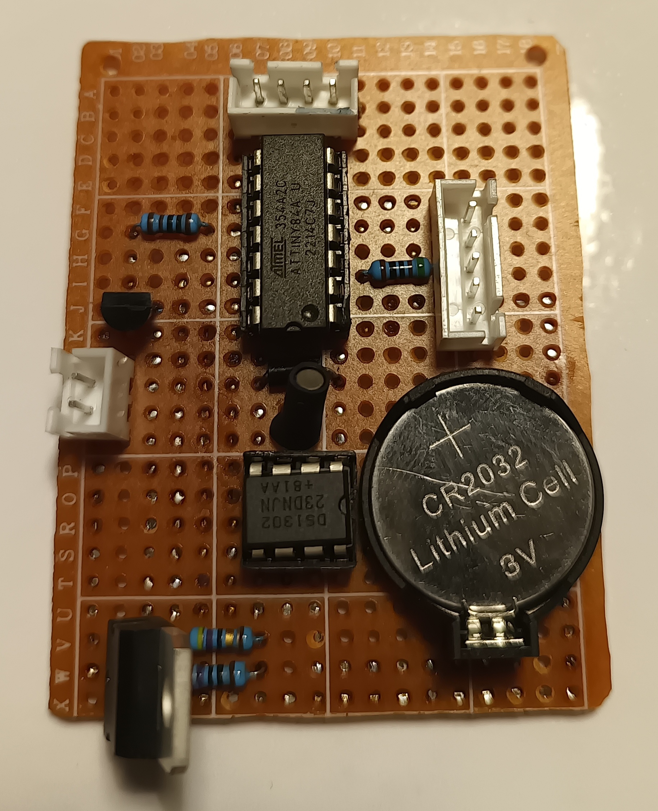
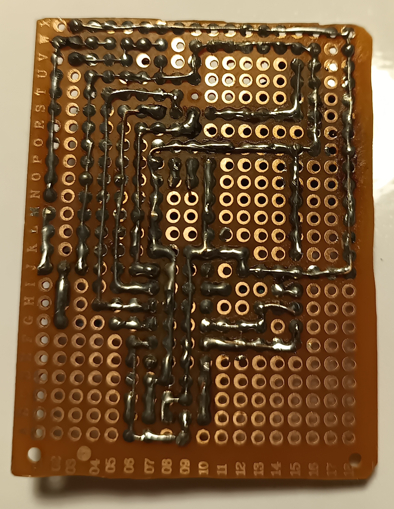

# AlarmClock

Converted classical analogue clock to a digital alarm clock with built-in charging hub.

## Features
- Integrated functionality of motor ringing alarm bells
- LCD Screen with current time and alarm time
- 2 buttons used to set time and alarm time
- Accurate time with DS1302 IC
- USB charging hub with 4 ports
- Based on ATtiny84 MCU

## Perfboard circuit sketch

## Photos

